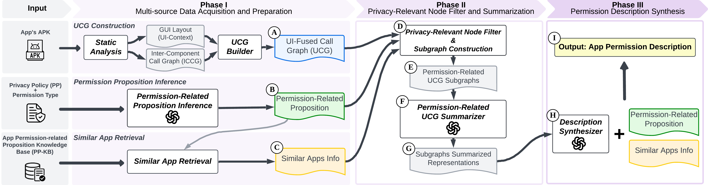

# AppBDS: App Behavior Description Synthesizer

## Introduction

AppBDS is a novel LLM-based framework that automatically generates detailed, app-specific descriptions of how Android apps use sensitive permissions. While current app stores only show what data is collected, AppBDS reveals how it's actually used by intelligently integrating code semantics, UI contexts, and privacy policies. By constructing UI-Fused Call Graphs (UCG) and leveraging knowledge from similar apps, AppBDS achieves 729%, 517%, and 656% improvements over state-of-the-art approaches in richness, specificity, and semantic relatedness respectively, providing users with meaningful privacy insights for informed decision-making.

## Overview

AppBDS operates through a three-phase pipeline that processes heterogeneous app data to generate comprehensive permission usage descriptions:

The framework consists of:
- **Phase I**: Multi-source Data Acquisition and Preparation - constructs UCG from APK files, extracts permission propositions from privacy policies, and retrieves similar app information
- **Phase II**: Privacy-Relevant Node Filter and Summarization - identifies critical nodes using six distinct patterns and generates specialized subgraphs
- **Phase III**: Permission Description Synthesis - executes parallel analysis across three branches and synthesizes final descriptions

For detailed implementation information, see our [Code Structure Documentation](https://github.com/AppBDS/AppBDS/blob/main/code/appbds/README.md).

## Evaluation Results

### RQ1: Overall Effectiveness

AppBDS significantly outperforms existing approaches across all metrics:

| Method | BERT-Score | Richness | Specificity | Semantic Rel. |
|--------|------------|----------|-------------|---------------|
| DescribeCTX | 0.717 | 1.03 | 1.29 | 0.82 |
| DescribeCTX_GPT | 0.832 | 6.33 | 6.22 | 3.99 |
| **AppBDS** | **0.875** | **8.54** | **7.96** | **6.20** |

### Privacy-Relevant Node Filtering Effectiveness

Our filtering approach reduces information size by ~99.9% while preserving critical content:

| | UCG | General | Proposition-Spec. | Similar-Apps-Spec. |
|---|-----|---------|-------------------|-------------------|
| **# Nodes** | 46,282 | 43 | 29 | 21 |

### RQ2: Human-LLM Evaluation Alignment

Human inspection validates our LLM-based evaluation metrics with strong correlations:

| Inspector | Metrics | Manual Inspection Results ||| Correlations vs LLM Results |||
|-----------|---------|------------|-----------------|---------|-------|-------|-------|
| | | **DescribeCTX** | **DescribeCTX_GPT** | **AppBDS** | **r** | **ρ** | **τ** |
| **Inspector 1** | Richness | 2.06 | 5.74 | **7.96** | 0.886 | 0.867 | 0.751 |
| | Specificity | 1.92 | 5.36 | **7.98** | 0.871 | 0.854 | 0.721 |
| | Semantic Rel. | 2.06 | 4.80 | **6.68** | 0.759 | 0.775 | 0.628 |
| **Inspector 2** | Richness | 2.16 | 7.40 | **8.22** | 0.922 | 0.829 | 0.717 |
| | Specificity | 2.06 | 7.42 | **8.36** | 0.890 | 0.782 | 0.649 |
| | Semantic Rel. | 2.04 | 7.30 | **8.28** | 0.799 | 0.798 | 0.660 |
| **Inspector 3** | Richness | 3.12 | 6.62 | **8.16** | 0.913 | 0.875 | 0.770 |
| | Specificity | 3.60 | 7.18 | **8.60** | 0.887 | 0.807 | 0.688 |
| | Semantic Rel. | 4.22 | 7.82 | **8.70** | 0.770 | 0.762 | 0.638 |
| **LLM Results** | Richness | 1.00 | 6.49 | **8.44** | --- | --- | --- |
| | Specificity | 1.36 | 6.31 | **7.92** | --- | --- | --- |
| | Semantic Rel. | 1.02 | 4.35 | **6.04** | --- | --- | --- |

### RQ3: Ablation Study

Component analysis demonstrates the importance of each pipeline element:

| Method | BERT-Score | Richness | Specificity | Semantic Rel. |
|--------|------------|----------|-------------|---------------|
| **AppBDS** | **0.875** | 8.54 | 7.96 | **6.20** |
| AppBDS_NoPatterns | 0.856 | 7.70 | 6.80 | 4.28 |
| AppBDS_NoGen&Prop | 0.809 | 7.38 | 7.31 | 4.92 |
| AppBDS_NoGen&Sim | 0.834 | 7.21 | 7.04 | 4.63 |
| AppBDS_NoSim&Prop | 0.839 | **8.60** | **8.20** | 6.14 |

